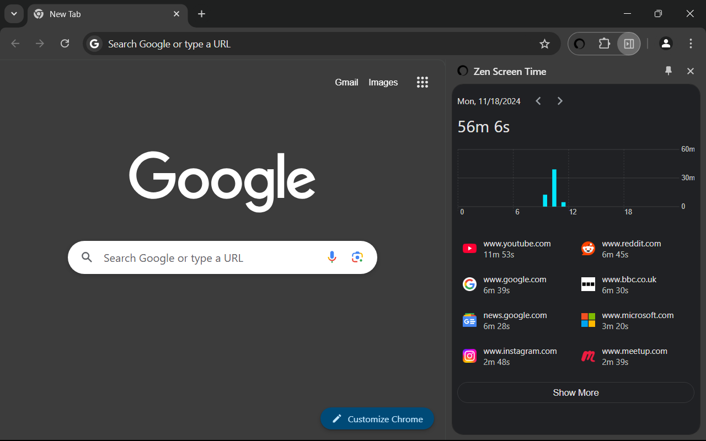

# Zen Screen Time

This is a Chrome extension inspired by Screen Time from iOS. With it, you can view how much time you spend on each website in your desktop Chrome (done!) and set up time limits (in progress!).

You can [install it from the Chrome Web Store](https://chromewebstore.google.com/detail/zen-screen-time/lnhoabacmnkaepaabhoiehgelofdmdlh), or download a release from the [Releases](https://github.com/chukonu/zen-screen-time.crx/releases) page, [unpack and load it in developer mode](https://developer.chrome.com/docs/extensions/get-started/tutorial/hello-world#load-unpacked).

## Screenshot

## Technical summary

From a technical perspective, this project experiments with some more recent APIs in web and JavaScript development, and explores some ideas, including -

- Using Chrome's recent **[Side Panel API](https://developer.chrome.com/docs/extensions/reference/api/sidePanel)** to build an extension that accompanies the user's browsing experience

- Using **[Lit](https://lit.dev/)** (Web Components) to build a whole SPA

  - Using [Reactive Controllers](https://lit.dev/docs/composition/controllers/) and [Tasks](https://lit.dev/docs/data/task/) to separate concerns

- Using **[D3](https://d3js.org/)** for animated data visualisation, e.g. making the chart responsive to viewport changes

- Using **[decorators](https://www.typescriptlang.org/docs/handbook/decorators.html)** to centralise cross-cutting boilerplate code, e.g. event listener registration

  - With decorators, we can set up handlers for routes/messages in a declarative manner. This will hide away shared, lower level code such as initialisation and cleanup.

- Using **[utility types](https://www.typescriptlang.org/docs/handbook/utility-types.html)** of TypeScript to make code more type-safe

- Using reactive extensions (**[RxJS](https://rxjs.dev/)**) to model concurrent data flows for maintainability and flexibility

  - Extracting shared concerns into operator functions for reusability
